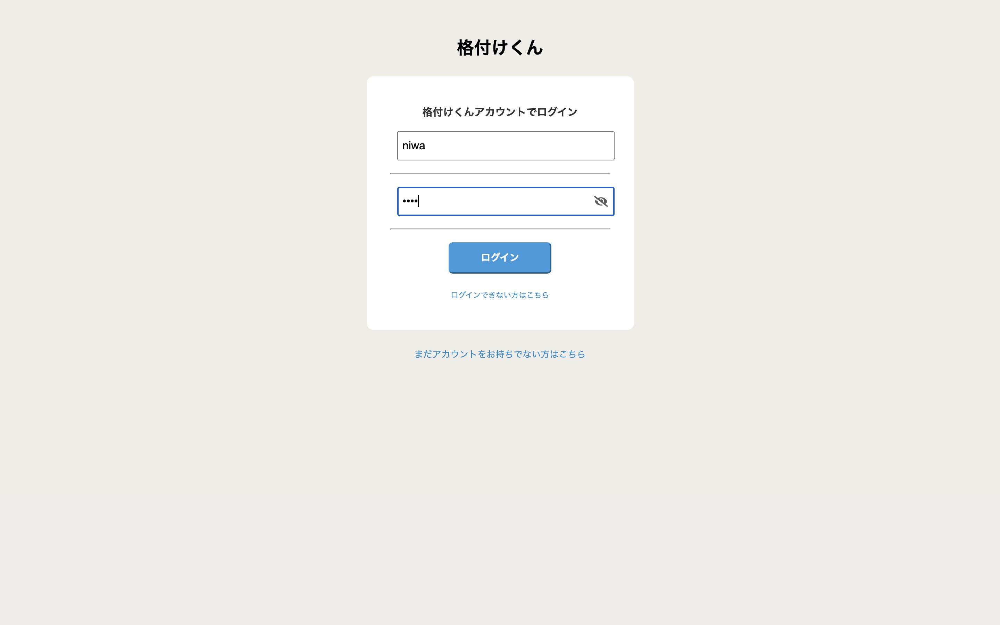
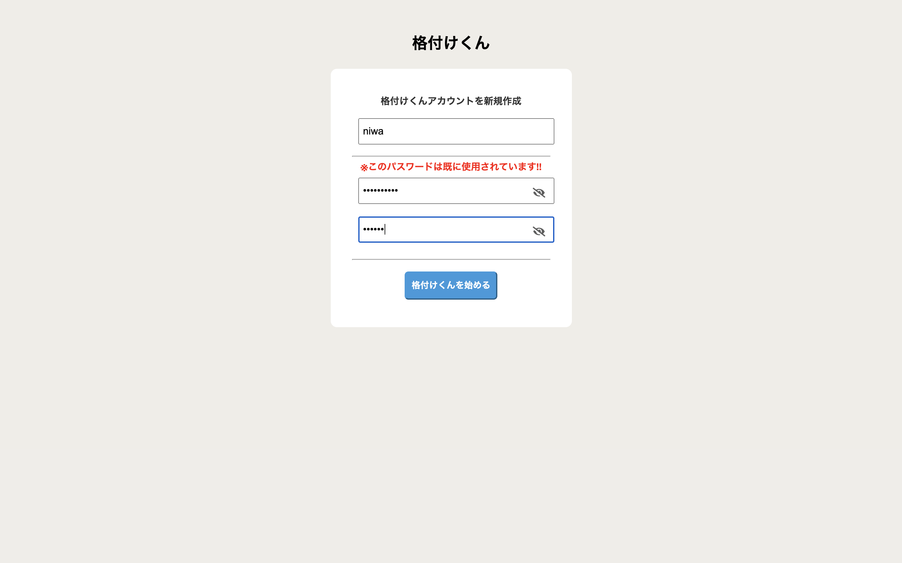
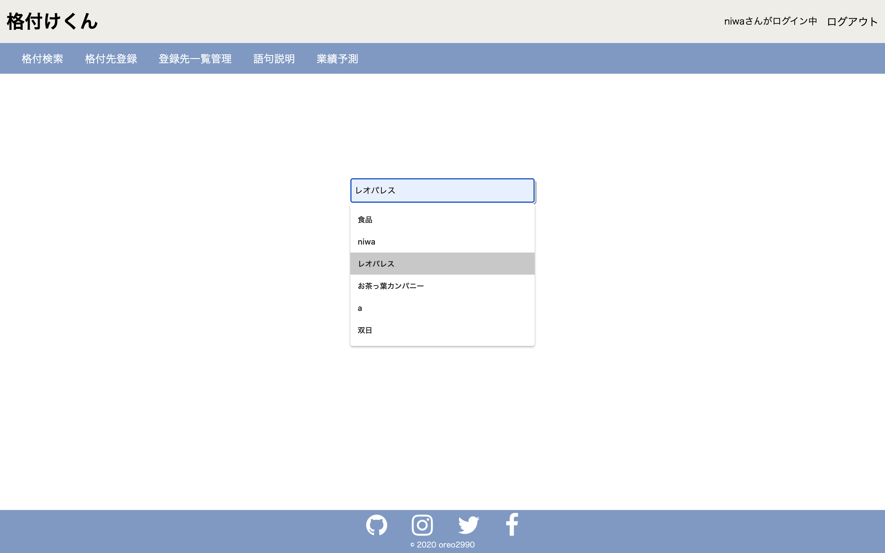
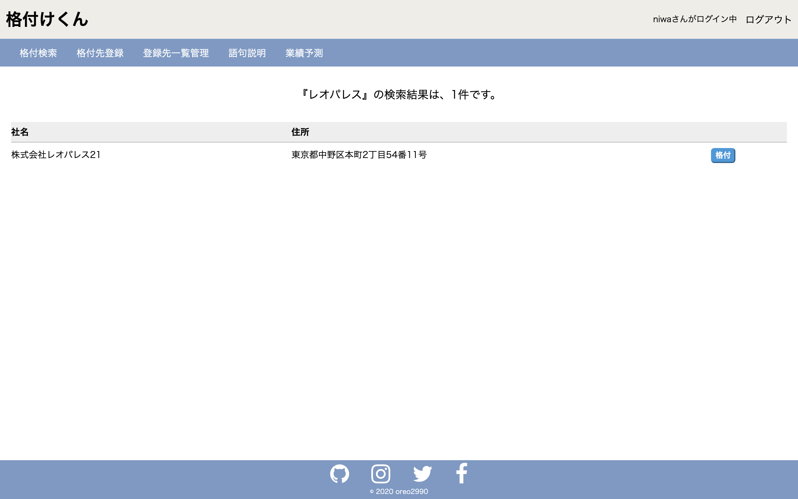
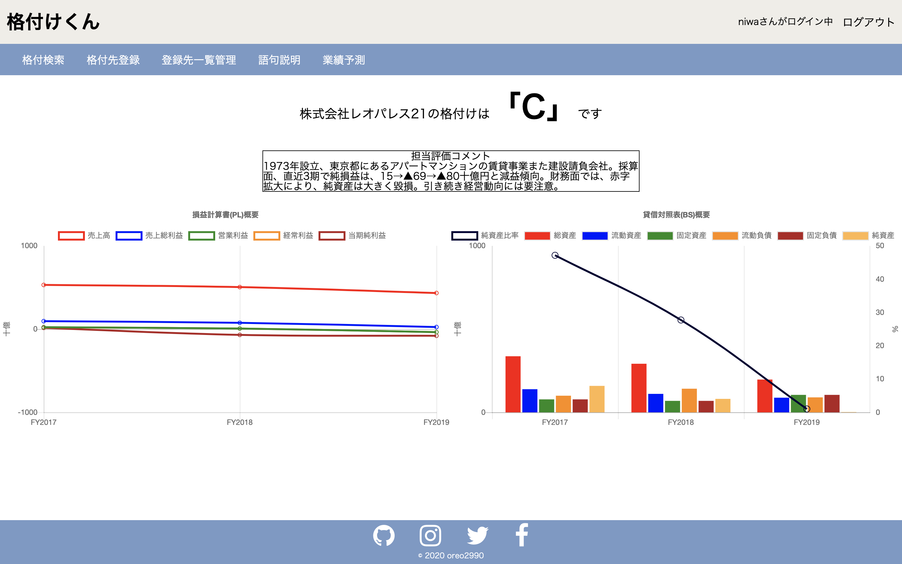
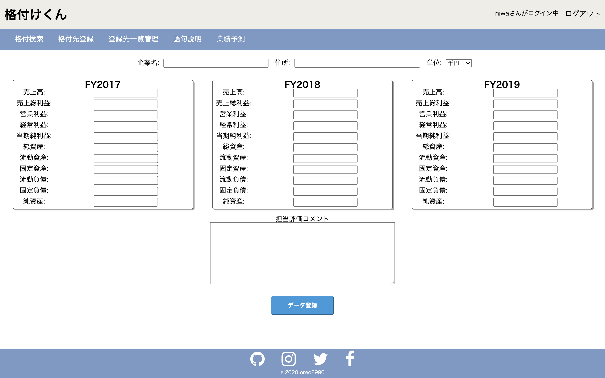
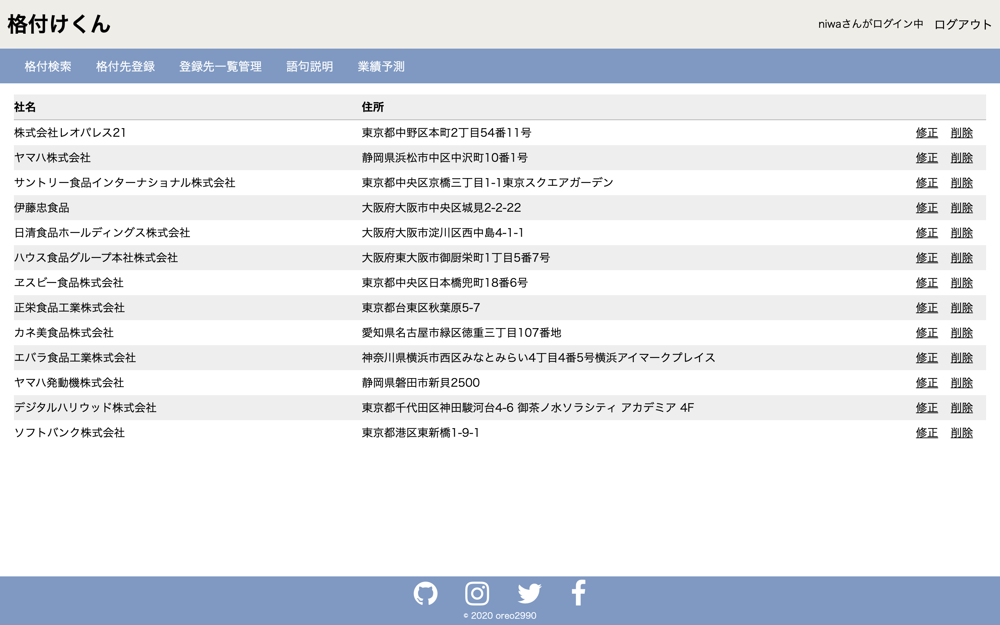
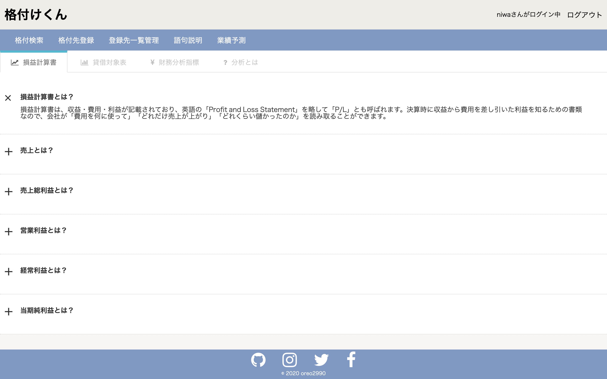
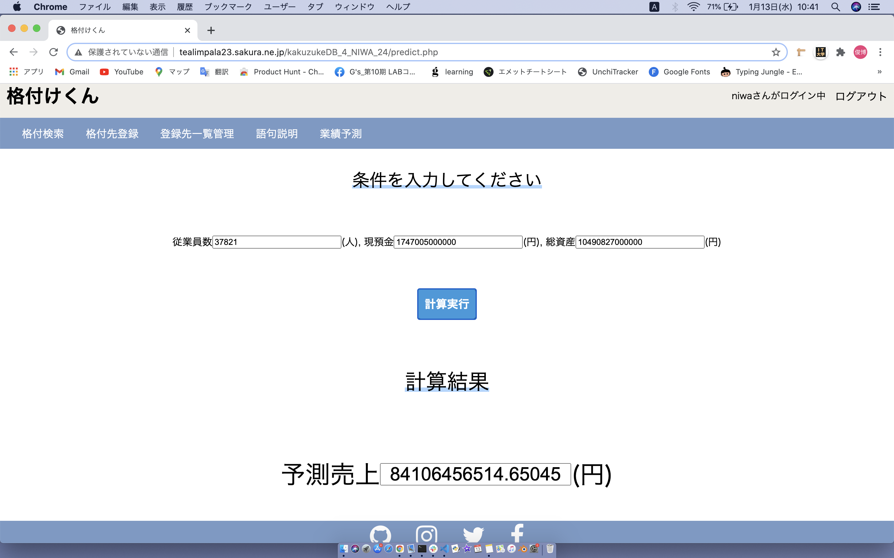

# 企業分析ツール「格付けくん」（完成形）を作成しました（制作期間約7日）。

## プロダクト概要

企業の財務分析ツールです。直近3期のPL、BSを入力すると、財務内容から「A」〜「C」の企業格付を付与できます。また、財務情報のグラフ化、業績予測等も実装しました。

ページ構成は、①ログイン画面、②アカウント作成画面、③格付検索画面、④格付検索の結果画面、⑤分析結果画面、⑥PL、BSの数値入力/登録画面、⑦mySQL登録情報の修正/削除画面、⑧財務分析関連の語句説明画面、⑨業績予測画面の9ページとなっています。

プログラミングを学び始めて2ヶ月の成果物で、これまで学んできたHTML、CSS、JS、PHPに加えてPythonを用いて機械学習（教師あり学習の回帰）にチャレンジしました。

http://tealimpala23.sakura.ne.jp/kakuzukeDB_4_NIWA_24/login.php

Id = niwa,pass = niwaでデータが入った状態で確認できます。

###### ①ログイン画面

###### ②アカウント作成画面

###### ③格付検索画面

###### ④格付検索の結果画面

###### ⑤分析結果画面

###### ⑥PL、BSの数値入力/登録画面

###### ⑦mySQL登録情報の修正/削除画面

###### ⑧財務分析関連の語句説明画面

###### ⑨業績予測画面

## 作成背景

これまでの仕事で、取引先や投融資案件の与信判断(財務三表の分析)を行ってきました。その経験を生かして、誰でも気軽に、簡単な企業の財務状況が把握できる様に、と作成しました。

## 使用技術
PHP、mysql、chart.JS、Python、Keras、scikit learn、TensorFlow.js

## 工夫した点
- ログイン/ログアウト機能の実装

- アカウント作成画面で、登録済みのパスワードは入力不可となっています。

- 直近3期のPL、BS入力値を、mysqlに保存、保存したデータを、「企業名」で検索し、企業格付けを確認できます。

- 企業格付けでは、chart.jsを用いて、PL、BSを図式化しています。また、入力値に対して、直近3期の純利益平均、流動比率平均、純資産平均からスコアリングを行い、対象企業を「A」から「C」の3ランクに振り分けました（デプロイすることを目的にしていた為、所属業界の特性等は考慮していない、非常に簡易的な財務分析です）。

- mysqlに保存したデータは、修正及び削除が可能です。

- 財務分析の経験がない方の為に、語句説明画面で、財務三表や分析方法の説明をしています。

- 機械学習（教師あり学習の回帰分析）を実施しました。
 
  2019年度の上場企業2430社の従業員数、現金、総資産、売上のデータを準備(下記、参考1ご参照)。Google Colabortory、TensorFlow.js等を用いて、データの分割（学習用：テスト用＝8:2）→学習用データを用いた
  売上予測モデルの作成を行いました(下記、参考2を参考にしました)。この時、活性化関数は、RMSprop、損失関数は、mean_squared_errorに設定。なお、平均絶対誤差（テストデータでの実際の値と予測値の差の絶対値を
  平均したもの）は、331,149,108,461円(3311億円)と、全く当てにならない業績予測モデルとなっています。今回は、機械学習を組み込んだサービスをデプロイすることに注力したので、予測の精度向上までは、手が回りません
  でした、、、

  ※参考1
 
  https://qiita.com/teatime77/items/e480ae958bf81750753b
 
  ※参考2
 
  https://ashikapengin.com/2019/08/14/yosoku-kion/
 
  ※売上予測例
 
   例として、ソフトバンク株式会社の2021年度2Q(9月30日時点)の従業員数、現金、総資産から2021年度2Q(9月30日時点)の売上を予測しました（詳細下記）。格付けくんの予測では841億円の一方で、正解（2021年度2Q
   のソフトバンク売上）は、2兆4千億円と、大幅な解離となりました。
 
   従業員数37821(3万7千人)
 
   現金1747005000000(1兆7千億円)
 
   総資産10490827000000(10兆5千億円)
 
   予測値84,106,463,700(841億円)

- フッターには、私のSNSアカウントのリンクを載せています。

## 特に注力した点
新しい技術を早くキャッチアップし、実装することに注力しました。7日間の中で、そもそも機械学習とは？という所から勉強を始め、web検索や書物参照で実装までたどり着くことができした。

## 課題
- 教師データの分析不足

  機械学習では、データを学習させる前に、データの法則性の把握や加工が必要。データ構造を把握した上で、学習させるデータを決定し、損失関数や活性化関数を設定しなければならないが、そこに手を回せなかった。
  今回は、学習させるデータ（売上、従業員数、現預金、総資産）は、決め打ちです。
 
- データの前処理(正規化など)が恐らく適正じゃない。
